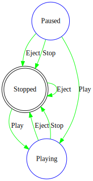

In case if we have to develop a [workflow](https://en.wikipedia.org/wiki/Workflow), we might end up wrting too many if/else and/or switch conditions, which might affect code readability and maintainability when there are too many states and events, which is where a [State Machine](https://en.wikipedia.org/wiki/Finite-state_machine) will be quite useful.

In order to use BoltOn's [`FiniteStateMachine`](https://github.com/gokulm/BoltOn/blob/master/src/BoltOn/StateMachine/FiniteStateMachine.cs), you have to do the following:

* Install **BoltOn** NuGet package.
* Declare states and events, simple enums will be better (classes can be used too, but see to that you override Equals and GetHashCode methods), something like this:

        public enum MusicPlayerState
        {
            Stopped,
            Playing,
            Paused
        }

        public enum MusicPlayerEvent
        {
            Play,
            Stop,
            Pause,
            Previous,
            Next,
            Eject
        }

* Create a class encompassing the state machine with all the state transitions. Something like this:

